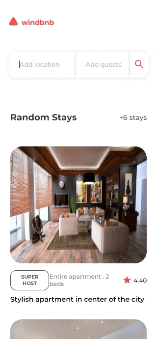

<h1 align="center">WindBnB Challenge</h1>

<div align="center">
   Solution for the WindBnB Challenge using React.js - carlos.pabon.code - <a href="http://devchallenges.io" target="_blank">Devchallenges.io</a>.
</div>

<div align="center">

  <h3>
    <a href="https://comfy-stroopwafel-4ccaa2.netlify.app/">
      Solution
    </a>
    <span> | </span>
    <a href="https://devchallenges.io/challenges/3JFYedSOZqAxYuOCNmYD">
      Challenge
    </a>
  </h3>
</div>

## Table of Contents

- [Overview](#overview)
  - [Built With](#built-with)
- [Features](#features)

## Overview

These are the steps I made to complete the challenge:

First I created the project with create-react-app, I deleted the files I didn´t need
and edited the default files that I was going to use. Next, I reviewed and extracted
the resources I needed for the project from the figma file(Logo,Fonts,colors,icons). For this project I used a mobile first approach, so, I started with the development of the home page with the mobile design provided in Figma.

I divide all in components and started with the home component, developed the header with the logo and the search component. Next, I made the apartment component and added the styles and logic based on the data provided on the design. Finally, I develop the logic for the search.

### Built With

- [React.js](https://es.reactjs.org/)
- [Styled components](https://styled-components.com/)

```sh
npm install --save styled-components
```

- [MUI Icons Material](https://mui.com/components/material-icons/)

```sh
npm install @mui/icons-material
```

## Features

You can search for these three cities (Helsinki, Tokyo, Ginebra) or by country (Finland,Japan or Switzerland), When you click on the location input in the search modal it shows the coincidences depending on the search, if you select the guests input it will show the button to reduce or add the counter quantity for the adults and children buttons. Important: I made a validation to the search button, so it will only be enabled if there are coincidences in the location search and after one of the coincidences is selected.

Here are some gifs to see the challenge in action:




